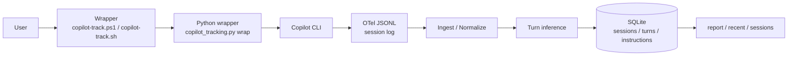
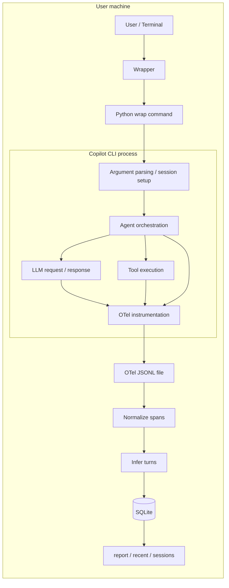
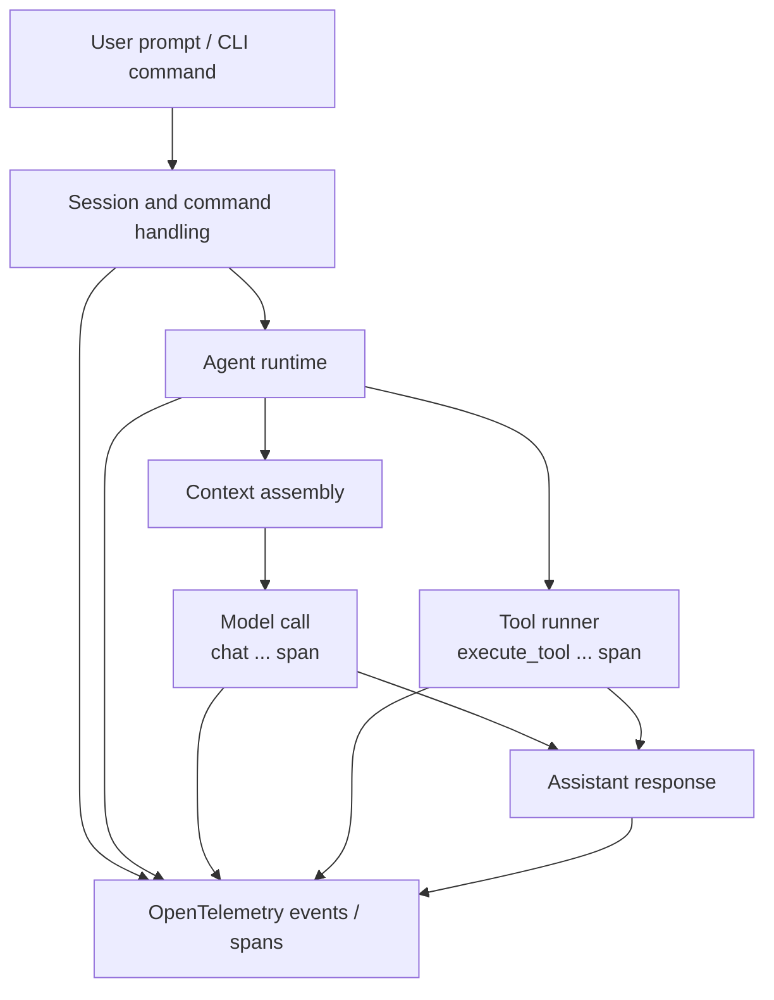

# copilot-tracking チーム向け発表台本

## 0. 発表のゴール

今日は `copilot-tracking` について、何を解決したいツールなのか、どういう構成で動いているのか、どこまでを現在スコープとしているのかを共有します。  
あわせて、レビューでは設計の妥当性と将来の拡張余地を中心に見ていただきたいです。

## 1. 導入: これは何か

`copilot-tracking` は、Copilot CLI を置き換えるツールではなく、**外側から観測するための軽量ラッパー** です。

やっていることはシンプルで、Copilot CLI 起動前に OpenTelemetry の JSONL 出力を有効化し、実行後にその JSONL を SQLite に取り込みます。  
その結果、各ターンについて prompt、response、model、token usage、tool call 回数や時間をあとから分析できるようになります。

ポイントは、**Copilot CLI 本体に手を入れず、ローカル完結で、常駐プロセスも不要** という点です。

## 2. なぜ必要か

Copilot CLI は日々の作業には便利ですが、チームで使うと次のような問いに答えにくいです。

- どのタスクで時間がかかっているのか
- どのモデルがどのくらい使われているのか
- ツール呼び出しが多い依頼は何か
- 長い instruction や context が応答時間や token 消費にどう効いているか

画面上の体感だけではなく、**あとから振り返れる記録** にするのがこのツールの目的です。

## 3. どう使うか

使い方はかなり単純です。  
PowerShell なら `copilot-track.ps1`、bash 系なら `copilot-track.sh` を経由して Copilot CLI を起動します。

このラッパーは内部で Python スクリプト `copilot_tracking.py wrap` を呼び出します。  
`wrap` は追跡用の環境変数を設定して `copilot` コマンドを起動し、終了後に出力された OTel JSONL を SQLite に取り込みます。

その後、`recent`、`report`、`sessions` で結果を見ます。

## 4. アーキテクチャ全体

全体像は次の流れです。

1. ユーザーがラッパー経由で Copilot CLI を起動する
2. ラッパーが OTel の file exporter を有効化する
3. Copilot CLI がセッションごとの JSONL を出力する
4. Python スクリプトが JSONL を読み、span を正規化する
5. span 群から turn 単位の情報を推論する
6. SQLite に `sessions`、`turns`、`instructions` として保存する
7. レポート系コマンドであとから参照する

この構成にした理由は、**収集と参照を分離したかったから** です。  
JSONL は生の観測データ、SQLite は分析しやすい形に正規化したデータ、という役割分担です。

### 図1: copilot-tracking 全体アーキテクチャ

### 図2: Copilot CLI を含めた詳細アーキテクチャ

## 5. 層ごとの責務

### Wrapper 層

`copilot-track.ps1` と `copilot-track.sh` は薄いラッパーです。  
OS 差分を吸収しつつ、最終的には `copilot_tracking.py wrap` に処理を委譲します。

### Execution 層

`wrap` は以下の役割を持ちます。

- ログ保存先ディレクトリを作る
- セッション ID を採番する
- OTel 関連環境変数を設定する
- `copilot` コマンドを通常どおり起動する
- 終了後に生成 JSONL を取り込む

この層の狙いは、**普段の Copilot CLI の使い方を崩さずに計測を差し込むこと** です。

### Ingest / Normalize 層

ここが実装上の中心です。  
OTel JSONL には、CLI バージョン差分や出力形式差分があります。

そのため、このツールでは以下を吸収しています。

- `resourceSpans` 形式
- 1 行 1 span 形式
- 複数候補の属性名

つまり、生ログの揺れをここで吸収して、上位層では同じ見え方に寄せています。

### Turn Inference 層

このツールは span をそのまま見せるのではなく、**人がレビューしやすい turn 単位に再構成** します。

trace ごとに span を集め、まず `invoke_agent` をルート候補にします。  
その配下から `chat...` span と `execute_tool...` span を集めて、1 turn の prompt、response、tool usage を組み立てます。

ここで保存するのは主に次です。

- prompt
- response
- instructions
- model
- input / output / total tokens
- context_input_tokens
- tool_calls
- tool_duration_ms
- raw_json

### Storage / Query 層

SQLite には 3 つの主要テーブルがあります。

- `sessions`: セッション単位のメタデータ
- `turns`: ターン単位の集約結果
- `instructions`: turn に紐づく instruction の配列

参照系コマンドは次の役割です。

- `recent`: 直近 turn の詳細表示
- `report`: 一覧表示
- `sessions`: セッション一覧
- `--live`: SQLite ではなく進行中 JSONL を直接読む

`--live` を分けていることで、**実行中の観測** と **終了後の確定データ参照** を両立しています。

## 6. Copilot CLI の記録仕様として押さえている前提

このツールは、Copilot CLI が OpenTelemetry を file exporter で出せることを前提にしています。

主な前提は次です。

- OTel を環境変数で有効化できる
- 出力は JSONL
- span 名として `invoke_agent`、`chat ...`、`execute_tool ...` のような単位がある
- 属性として model、messages、tokens、context usage 系が入る
- content capture は ON/OFF を切り替えられる

この記録仕様はこのツールが勝手に定義したものではなく、**Copilot CLI が出す観測データを利用している** という整理です。

一方で、属性名は固定ではない可能性があります。  
そのため実装では、たとえば prompt なら `gen_ai.input.messages` や `prompt` など複数キーを順に見にいきます。

ここは互換性のための重要な設計ポイントです。

## 6.1 Copilot CLI のアーキテクチャ図

プレゼンでは、Copilot CLI 自体は次のような構造として説明すると分かりやすいです。  
ここでは実装詳細を断定するのではなく、`copilot-tracking` から観測できる責務分解として図示しています。

この図で伝えたいのは、Copilot CLI の中心は単純な 1 回の LLM 呼び出しではなく、**セッション制御、エージェント実行、ツール実行、応答生成を含む実行系** だという点です。  
`copilot-tracking` はその内部実装に直接入るのではなく、OTel 経由で外から観測しています。

## 7. Claude Code との違い

ここは誤解が出やすいので、比較対象はモデル性能ではなく、**観測インターフェース** として説明します。

現状の `copilot-tracking` は Copilot CLI 専用です。  
理由は、入力として期待しているのが **Copilot CLI の OTel JSONL スキーマ** だからです。

Claude Code と比較すると、少なくとも次が異なる可能性があります。

- ログ出力の仕組み
- span / event の表現
- tool call の表現
- session / turn の識別方法
- token usage や context usage の属性名

なので、今の設計はマルチプロバイダ対応ツールではなく、**Copilot CLI の観測に最適化した設計** と位置づけるのが正確です。

逆に言うと、将来 Claude Code まで広げたいなら、SQLite スキーマを先に共通化するより、**入力正規化の adapter 層** を分けるのが自然です。

## 8. セキュリティと運用上の注意

このツールは prompt / response を保存できます。  
そこが価値でもありますが、同時に注意点でもあります。

考慮すべき点は次です。

- 機密情報がログと DB に残る可能性
- ローカル端末上の保存ポリシー
- チーム利用時の持ち出しや共有範囲
- `--no-capture-content` を使う運用ルール

つまり、これは単なる技術実装の話ではなく、**記録ポリシーの設計** とセットで考える必要があります。

## 9. 将来の拡張性

今後の拡張案として考えているのは次です。

1. Provider adapter 化
   - Copilot 専用実装から、`CopilotAdapter`、`ClaudeAdapter` のような構成へ寄せる
2. raw span の保持方法の拡張
   - 現在は `turns.raw_json` に集約しているが、より詳細な分析用に分離可能
3. マスキング / 匿名化
   - ingest 時に secrets や個人情報をマスクする
4. 分析の高度化
   - モデル別比較、tool usage 分布、task 種別別の token 分析
5. 出力先拡張
   - SQLite から DuckDB / Parquet などへの展開

ここで重要なのは、今の構成がその第一歩として妥当かどうかです。  
最初から大きくしすぎず、**まずは Copilot CLI で価値を証明する** という段階だと考えています。

## 10. レビューで見てほしいこと

今回のレビューで特に見てほしいのは次の 4 点です。

1. Copilot CLI の OTel 出力を turn 単位に正規化する設計が妥当か
2. JSONL と SQLite の責務分離が適切か
3. provider 拡張を見据えた構造に無理がないか
4. prompt / response 保存に対するセキュリティ境界が十分か

## 11. 締め

`copilot-tracking` は、Copilot CLI を置き換えるものではなく、**使い方を変えずに分析可能性を追加するツール** です。  
構成は小さく、導入負荷は低く、将来的には複数エージェント比較の基盤にも伸ばせます。

まずは Copilot CLI 専用の観測基盤として成立しているかを見ていただき、そのうえでスキーマの安定性、セキュリティ、拡張余地を議論したいです。
